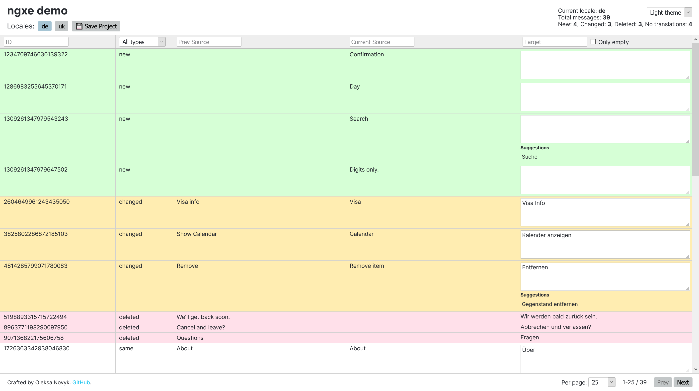

[](https://www.npmjs.com/@novyk/ngxe)


# 📜 ngxe

Angular 11.1+ JSON Translations Editor.

A simple UI for your translations: hosted on NPM, runs on your dev machine.

### Features

* Works directly with your files, no additional routine.
* Any number of locales.
* Diff changes.
* Filters, handy pagination.
* Suggestions based on similar sources.
* Themes: light, solarized, dark.

### [The front app demo — ngxe.oleksanovyk.com](https://ngxe.oleksanovyk.com/)




## Installation

```shell
$ npm i @novyk/ngxe -D
```


## Usage

#### Create `ngxe.json` config file in the root:

```json
{
  "name": "Project Name",
  "input": "messages.json",
  "output": {
    "source": "messages.en.json",
    "translations": [
      {
        "locale": "de",
        "path": "messages.de.json"
      }
    ]
  }
}
```

* `input` - file generated by Angular, you can add it to `.gitignore`
* `output.source` - copy of the input file, but ordered by keys (need for further transitions and smooth committing to Git).
* `output.translations` - target locales.

#### Extract translations from your project in JSON format:

```shell
$ ng extract-i18n --format=json
```

The editor works best if i18n messages have IDs, but it is not necessary:

```
<div i18n="@@MSG_ID">Message with ID</div>
...
$localize`:@@MSG_ID_2:Message with ID 2`;
```

#### Use ngxe:

```shell
$ npx ngxe
```

Browser should open the app (http://localhost:7600/).

Use the ngxe app to update messages and press `Save Project` (all `output` files will be updated).

###### Optional config path:

```shell
$ npx ngxe -p=./path/to/ngxe.json
```

#### Build your app

1. You can use the default flow with separated build for each lang.
2. **Or** import messages on the app bootstrapping in `main.ts`:

```ts
import { loadTranslations } from '@angular/localize';

...

loadMessages()
  .then(() => {
    platformBrowserDynamic().bootstrapModule(AppModule);
  })
  .catch(err => console.error(err));
  
async function loadMessages() {
  // Detect lang and compile proper path to messages here:
  const path = ...;
  const m = await import(path);
  loadTranslations(m.translations);
}
```


## Config

Interface of the `ngxe.json` file: [meta/config.ts](/projects/meta/config.ts)


## Convert existing `xlf` files to `json`

```shell
$ npm i @locl/cli -D
$ npx locl convert -s=path/to/messages.de.xlf -f=json -o=path/to/messages.de.json
```

You can get error: `The translation file "path/to/messages.de.xlf" does not contain a target locale and no explicit locale was provided for this file.`

Make sure you have the `target-language` attribute in `xlf` file:

```xml
<?xml version="1.0" encoding="UTF-8" ?>
<xliff version="1.2" xmlns="urn:oasis:names:tc:xliff:document:1.2">
  <file source-language="en" target-language="de" ...>
    ...
```

After that you can delete `@locl/cli` package. 
